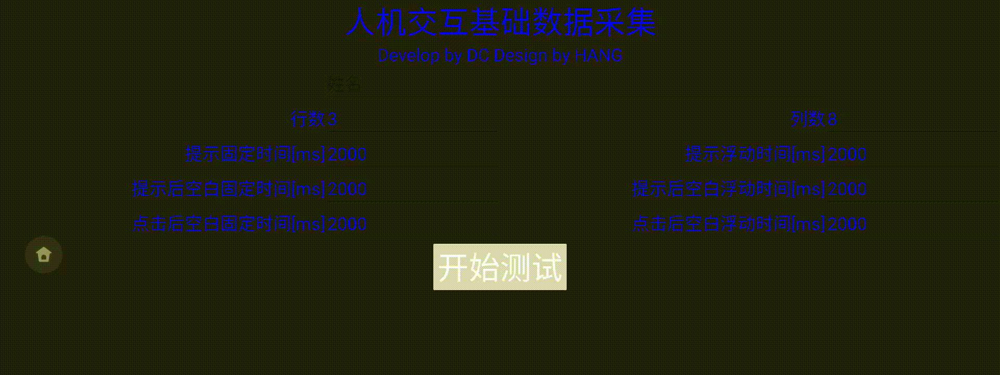

# ☺DC's CV☺ #

<!-- Project  ☺☺ -->
 
 
 

<!-- Project Preface -->

## Basic Information ##
```
#############################################################################
#  _________     _                 _____   _____      __  __      _         #  
# |___   ___|   (_)  _________    |  __ \ / ____|    |  \/  |    | |        #
#  ___| |___      _ |_________|   | |  | | |   ______| \  / | ___| | ___    #
# |___   ___|    (_)    | |       | |  | | |  |______| |\/| |/ _ \ |/ _ \   #
#  ___| |___    /|   ___| |___    | |__| | |____     | |  | |  __/ | (_) |  #
# |_________|  (_)  |_________|   |_____/ \_____|    |_|  |_|\___|_|\___/   #
#                                                                           #
#############################################################################
```
- Expected location: Singapore/Overseas
- Looking for: Back-end development(Java, Go, C++)
- About me: https://github.com/DC-Melo/README
- Project: https://github.com/DC-Melo
- Contact: wangjiang@alumni.tongji.edu.cn +65-8941-7932


## Work experience & educational background ##


## Main skills ##
- Paper ability: Read many English papers and books. JVM, Introduction to Algorithms, Deep Learning (Lan Goodfellow), Deep Learning with Python, Bitcoin Whitepaper 
- Mathematics basics: familiar with matrix calculations, familiar with probability theory, familiar with complex variable functions, familiar with Lie group Lie algebra
- find max value problems, quick learn, solve problems 
- skill tool chain
```                     
 +------------+    +-------------------------+    +---------------------+
 |            |    |                         |    |                     |
 |JAVA        |    |JDB,JVM,Maven,Gradle     |    |Spring,Hadoop,Spark  |
 |Python,GO   |    |pudb                     |    |TensorFlow,CNN       |
 |C/C++,Linux +--->|CMake,GDB                +--->|OpenCV,OpenGL,SLAM   |
 |PCB,ASM,uCos|    |altium designer freescale|    |PCB,HIL,CANoe        |
 |Mathematics |    |                         |    |                     |
 |            |    |                         |    |                     |
 +------------+    +-------------------------+    +---------------------+
```

## Personality and Hobbies ##
- **Like literature, sports, and various team activities** I like various team activities, participate in various social societies, forums, and use the power of the team to do greater things.
- **No challenge, no joy** Cheerful personality, full of challenging spirit, like to try new things, like a fluid life, and have strong adaptability
- **Play professional and advanced if you like** I like sports. Including: motorcycles, roller skating, skiing, badminton, backpacking
- **I like to show and share** I like to read various papers, listen to and share reports, and also like to share technology
  


## work experience ##


### 2019.05-至今    梧桐车联（腾讯CSIG智慧出行事业部） ###
- **Python**   组织团队构建测试框架，开发python测试框架基础原子方法，将模版化的中文测试用例，通过vim编辑器快速生成测试用例脚本。团队经过简单调试，合校即可将上千条测试用例投入使用。  
- **GO**       测试中心大约27个测试工具，按模块抓日志，获取各个APP版本号，运行monkey，检查ANR，CRASH，分析缺陷，自动提交缺陷等等。通过调研分析，GO语言非常适合做跨平台的命令工具。于是3天快速入门GO，两周完成27个功能中的20个功能的开发调试和使用培训。  
- **JAVA**     使用JAVA开发了一安卓打地鼠游戏，用于采集车机不同屏幕区域的点击便捷度。  
- **组织培训** 每月定期培训团队，赋能团队。培训内容包括: 嵌入式硬件基本知识，通讯基本知识基础,面向各种问题，使用对应编程语言解决问题。  
  
### 2016.10-2019.04 安吉四维导航系统、导航地图测试、车辆互联产品开发测试 ###
- **Linux**    测试基于Android的导航系统(给上汽红岩定制的产品)。具备Android系统定制能力(Linux+C编译)  
- **adb**      测试手机车机互联产品(为大众、上汽定制的产品)。具备APP测试开发能力、adb调试能力(Linux+Java+adb)  
- **OpenCV**   基于ROS设计物流AGV仿真系统。使用blender画3D模型，使用gazebo进行仿真，使用OpenCV进行图像处理。  
- **组织培训** 带领测试团队，组织安排车机测试工作。  
  
### 2012.06-2016.10 翼锐汽车仪表自动测试系统搭建   ###
- **CANoe,VB** 基于VB开发基于Excel测试用例管理系统、以及用户测试界面(VB)  
- **CAN,LIN,IO** 基于CANoe开发控制器测试系统,进行CAN总线信号测试和硬线信号测试(C+CAN)  
- **Python**   基于Python开发控制器一键快速编码程序(python)  
  
### 2009.09-2011.04 研究生阶段参与课题：燃料电池备用电源控制器开发（国家科技支撑项目） ###
- **Labview**  负责开发燃料电池备用电源人机界面，参与燃料电池备用电源系统控制流程设计 (Labview+C)  
- **Matlab**   用Matlab验证模糊神经网络算法控制散热系统。并在Freescale(NXP)芯片的控制器上实现控制算法(NNs+C)。  
- **PID,PWM**  基于freescale的DZ60芯片，使用PID算法控制燃料电池温度。
- **uCos-II**  基于freescale的256芯片移植实时操作系统uCos-II，并在uCos-II上实现系统的控制策略(汇编ASM+C语言)  

## 奖励情况 ##
2019.05-至今    工作三年,两年绩效考核最高等级  
2018.10-至今    三个专利  
2017.01-2017.02 获得年度优秀员工称号  
2016.07-2016.07 《基于Excel的一键控制器编码》获得劳动竞赛最佳金点子  
2014.08-2014.08 《基于数据库的半自动测试台架》获得大众联合创新大赛二等奖  


## Projects Table of Contents ##

### Projects Closed ###
- [C++-Bitcoin source code reading, changing, compiling, running](https://github.com/DC-Melo/)  
- [C++-Generate Bitcoin Vanity Address](https://github.com/DC-Melo/bitcoin_vanity_miner)
- [Python-Crawler crawls account addresses with more than 1 BTC in Bitcoin](https://github.com/DC-Melo/bitcoin_valued_address)
  
- [Spark+Map+Reduce-Commonly used password database sha512 into a private key, calculate the address through the private key, and then check whether the address has Bitcoin](https://github.com/DC-Melo/)
- [Bitcoin wallet DLL decoding and understanding, view the address and Bitcoin amount in the wallet](https://github.com/DC-Melo/)
- [JAVA-Bitcoin information crawler, detects new Bitcoin skyrocketing and plummeting news, and prompts SMS notifications](https://github.com/DC-Melo/)
- [GO-Android testing tool collection (27 commonly used testing tools)](https://github.com/DC-Melo/)
  
- [C#-based on Zhou Ligong CAN card real vehicle bus host computer development](https://github.com/DC-Melo/)
  
- [Python-基于周立功CAN卡进行总线自动化测试]( https://github.com/DC-Melo/)  
  
- [C-CAPL-基于CANoe进行总线自动化测试]( https://github.com/DC-Melo/)  
  
- [VIM-script-中文测试用例全自动转换Python测试代码]( https://github.com/DC-Melo/)  
- [Python-安卓接收测试五大原子方法实现]( https://github.com/DC-Melo/)  
  
- [JAVA-注意力分区研究APP](https://github.com/DC-Melo/Attention_Partition)  
  
  

- [SLAM-仿真自动驾驶AGV](https://github.com/DC-Melo/)  
  
  
  
  
  
  
- [CANoe+Linux-车机HIL测试系统]( https://github.com/DC-Melo/)  
- [Python-使用WEB微信发送定制化微信新年祝福]( https://github.com/DC-Melo/)  
- [JAVA-使用WEB微信仿制微信通讯]( https://github.com/DC-Melo/)  
  
- [Tensorflow+CNN-人脸识别]( https://github.com/DC-Melo/)  
  
  
  
  
- [MantisBT-制作公司bug跟踪系统]( https://github.com/DC-Melo/)  
  
- [LAMP-制作个人主页]( https://github.com/DC-Melo/)  
- [FFmpeg+Imagamagic-制作自定义GIF动图shell脚本]( https://github.com/DC-Melo/)  
- [JAVA-早期项目代码丢失，需要维护APP，于是反编译APP，更改蓝牙代码UUID再回编译]( https://github.com/DC-Melo/)  
- [HIL-实验室建设，测试太台架搭建]( https://github.com/DC-Melo/)  
  
  
- [JAVA-手机APP通过蓝牙连接嵌入式硬件读取大众车辆VIN号、油量等关键信息保存于手机]( https://github.com/DC-Melo/)  
  
  
- [Python-静安羽毛球馆定时爬虫抢票脚本]( https://github.com/DC-Melo/)  
  
  
  

- [CANoe+VBA+excel-仪表HIL测试系统]( https://github.com/DC-Melo/)  
- [uCos-II-移植实时操作系统uCos-II]( https://github.com/DC-Melo/)  
- [PID+C-基于PID控制PWM风扇实现控制燃料电池系统温度]( https://github.com/DC-Melo/)  
- [Matlab-验证模糊神经网络算法控制散热系统]( https://github.com/DC-Melo/)  
  
- [python-卡尔曼2D滤波估计]( https://github.com/DC-Melo/)  
  


### 正在进行项目Projects Ongoing ###
- [OpenGL+Blender-自己人像的射击游戏]( https://github.com/DC-Melo/)
- [GAN-图片生成3D人脸模型]( https://github.com/DC-Melo/)
- [GAN-deepfake-深度学习换脸]( https://github.com/DC-Melo/)

## Coding reference books ##
- books
  

