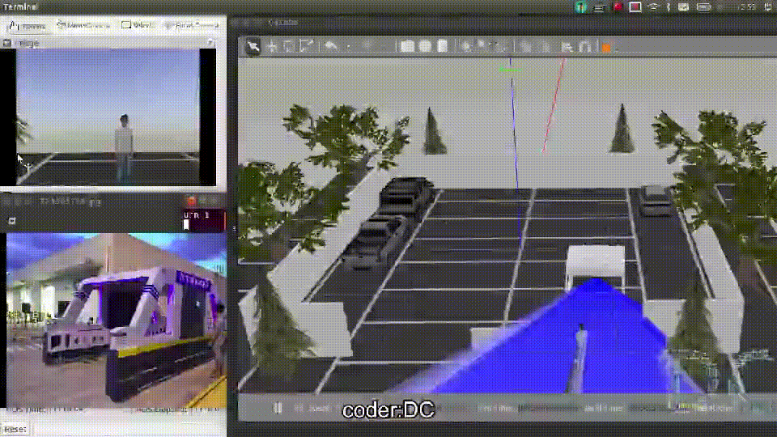
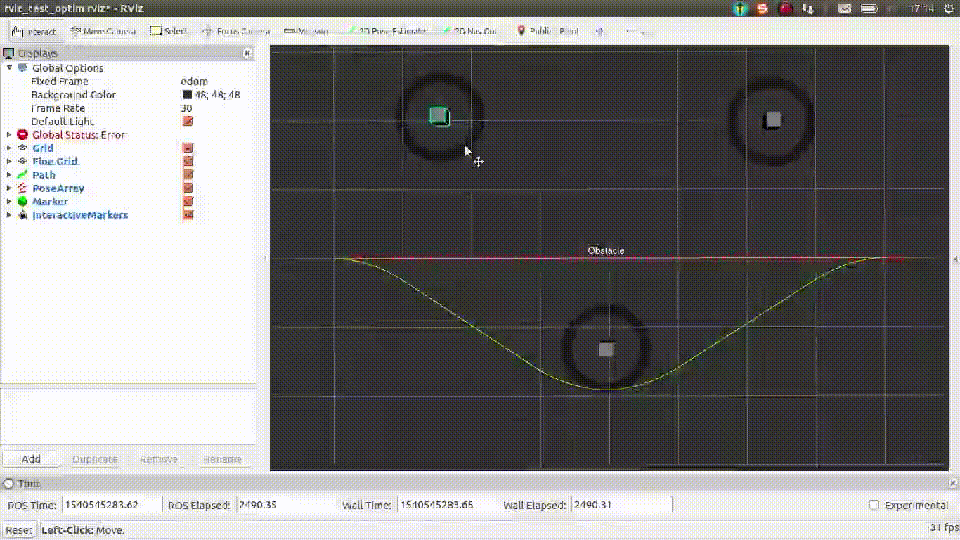

# ☺DC's CV☺ #

<!-- 项目标记☺☺ -->
 
 
 

<!-- 项目前言 -->

## 基本信息 ##
```
#  _________     _                 _____   _____      __  __      _       
# |___   ___|   (_)  _________    |  __ \ / ____|    |  \/  |    | |      
#  ___| |___      _ |_________|   | |  | | |   ______| \  / | ___| | ___  
# |___   ___|    (_)    | |       | |  | | |  |______| |\/| |/ _ \ |/ _ \ 
#  ___| |___    /|   ___| |___    | |__| | |____     | |  | |  __/ | (_) |
# |_________|  (_)  |_________|   |_____/ \_____|    |_|  |_|\___|_|\___/ 
```
**王江 DC-Melo**  
期待地点：海外北上杭深  
期待岗位：图像算法，计算机3D建模渲染显示，计算机视觉图像理解，以及涉及到的硬件  
个人简介：https://github.com/DC-Melo/README https://gitee.com/DC-Melo/README  
开源项目：https://github.com/DC-Melo        https://gitee.com/DC-Melo  
联系方式：wangjiang@alumni.tongji.edu.cn    +86-152-1670-6941  


## 工作经历&教育背景&主修课程 ##
2019.5-至今     | 北京梧桐车联（腾讯与长安合资公司）         | 测试开发主管         | 汇报对象:测试总监  
主要工作：HIL台架搭建，组织测试开发，构建测试原子方法，搭建测试框架,将中文用例转化为python代码填充到测试框架中，简单检查调试即可投入测试生产，测试工具集开发  

20016.10-2019.4 | 安吉四维（安吉物流与四维图新合资公司）     | 技术部门主管         | 汇报对象:技术总监  
主要工作：搭建导航系统测试系统，测试四维图新的导航地图。  

2012.06-2016.09 | 上海翼锐汽车科技有限公司(上汽大众设计公司) | 仪表驾驶辅助测试主管 | 汇报对象:股长  
主要工作：负责搭建大众MQB平台仪表测试系统和HUD测试系统、开发测试用例。  

2009.09-2012.05 | 同济大学(985/211)                          | 汽车学院             | 硕士  
主修课程：汽车试验、汽车动力学、现代控制理论、系统辨识、模糊控制、计算机控制基础、**数学基础优异**  

2005.09-2009.06 | 江苏大学                                   | 汽车与交通工程学院   | 学士  
主修课程：汽车构造、汽车理论、汽车电器、电路电子、自动控制理论、微机原理、汽车维修、汽车营销、管理学、**数学基础优异**  

## 主要技能: 面向问题快速学习、掌握编程工具、解决问题的能力 ##
- 面向问题、学习编程工具、解决问题  
```                     
 +------------+    +-------------------------+    +-------------------------------------+
 |            |    |                         |    |                                     |
 |PCB,ASM,uCos|    |altium designer freescale|    |PCB HIL CANoe                        |
 |C/C++,Linux +--->|CMake,GDB                +--->|OpenCV OpenGL FFmpeg ImageMagick SLAM|
 |Python,GO   |    |pudb                     |    |TensorFlow CNN                       |
 |JAVA        |    |JDB,JVM,Gradle           |    |Spring Hadoop Spark                  |
 |            |    |                         |    |GIMP Blender                         |
 +------------+    +-------------------------+    +-------------------------------------+
```

| 编程工具       | 对应工具链                | 发现问题、解决问题过程中掌握的编程              |
| :------        | :--------                 | :---------------                                |
| PCB,ASM,C,uCos | altium designer,freescale | PCB，硬件开发,驱动开发，信号分析,HIL台架        |
| C++,Linux      | CMake, GDB                | OpenCV,OpenGL,FFmpeg,ImageMagick,SLAM,Blender3D |
| Python GO      | pudb                      | 数据爬虫，测试框架，tensorflow机器学习 系统命令 |
| JAVA           | JDB,JVM,Gradle            | APP开发，中间件开发,集群运算                    |
- 兴趣涉猎：**机器学习算法NB，DT，SVM，KF，TensorFlow、CNN、GAN，RNN，SLAM**  
- 数学基础：熟悉矩阵计算，熟悉概率论，熟悉复变函数，熟悉利群李代数  
- 论文能力：读了较多的英文论文以及书籍。JVM，Introduction to Algorithms，Deep Learning（Lan Goodfellow），Deep Learning with Python，hadoop，spark  

## 性格爱好 ##
**无挑战不欢** 性格开朗、富有挑战精神、喜欢尝试新鲜事物、喜欢有流动性的生活、有较强的适应性  
**喜欢就要玩专业高级** 喜欢运动。包括：摩托车、轮滑、滑雪、羽毛球，背包旅行  
**喜欢展示分享** 喜欢看各种论文，喜欢听分享报告,也喜欢分享技术  


## 工作经验 ##


### 2019.05-至今    梧桐车联（腾讯CSIG智慧出行事业部） ###
- **Python**   组织团队构建测试框架，开发python测试框架基础原子方法，将模版化的中文测试用例，通过vim编辑器快速生成测试用例脚本。团队经过简单调试，合校即可将上千条测试用例投入使用。  
- **GO**       测试中心大约27个测试工具，按模块抓日志，获取各个APP版本号，运行monkey，检查ANR，CRASH，分析缺陷，自动提交缺陷等等。通过调研分析，GO语言非常适合做跨平台的命令工具。于是3天快速入门GO，两周完成27个功能中的20个功能的开发调试和使用培训。  
- **JAVA**     使用JAVA开发了一安卓打地鼠游戏，用于采集车机不同屏幕区域的点击便捷度。  
- **组织培训** 每月定期培训团队，赋能团队。培训内容包括: 嵌入式硬件基本知识，通讯基本知识基础,面向各种问题，使用对应编程语言解决问题。  
  
### 2016.10-2019.04 安吉四维导航系统、导航地图测试、车辆互联产品开发测试 ###
- **Linux**    测试基于Android的导航系统(给上汽红岩定制的产品)。具备Android系统定制能力(Linux+C编译)  
- **adb**      测试手机车机互联产品(为大众、上汽定制的产品)。具备APP测试开发能力、adb调试能力(Linux+Java+adb)  
- **OpenCV**   基于ROS设计物流AGV仿真系统。使用blender画3D模型，使用gazebo进行仿真，使用OpenCV进行图像处理。  
- **组织培训** 带领测试团队，组织安排车机测试工作。  
  
### 2012.09-2016.10 翼锐汽车仪表自动测试系统搭建   ###
- **CANoe,VB** 基于VB开发基于Excel测试用例管理系统、以及用户测试界面(VB)  
- **CAN,LIN,IO** 基于CANoe开发控制器测试系统,进行CAN总线信号测试和硬线信号测试(C+CAN)  
- **Python**   基于Python开发控制器一键快速编码程序(python)  
  
### 2009.09-2011.04 研究生阶段参与课题：燃料电池备用电源控制器开发（国家科技支撑项目） ###
- **Labview**  负责开发燃料电池备用电源人机界面，参与燃料电池备用电源系统控制流程设计 (Labview+C)  
- **Matlab**   用Matlab验证模糊神经网络算法控制散热系统。并在Freescale(NXP)芯片的控制器上实现控制算法(NNs+C)。  
- **PID,PWM**  基于freescale的DZ60芯片，使用PID算法控制燃料电池温度。
- **uCos-II**  基于freescale的256芯片移植实时操作系统uCos-II，并在uCos-II上实现系统的控制策略(汇编ASM+C语言)  

## 奖励情况 ##
2019.05-至今    工作三年,两年绩效考核最高等级  
2018.10-至今    三个专利  
2017.01-2017.02 获得年度优秀员工称号  
2016.07-2016.07 《基于Excel的一键控制器编码》获得劳动竞赛最佳金点子  
2014.08-2014.08 《基于数据库的半自动测试台架》获得大众联合创新大赛二等奖  


## 开源项目目录Projects Table of Contents ##

### 已经完成项目Projects Closed ###
- [C++-比特币源码阅读、更改、编译、运行](https://github.com/DC-Melo/)  
- [C++-生成比特币荣耀地址](https://github.com/DC-Melo/bitcoin_vanity_miner)  
- [Python-爬虫爬取比特币超过1BTC的账户地址](https://github.com/DC-Melo/bitcoin_valued_address)  
- [Spark+Map+Reduce-常用密码数据库sha512成私钥，通过私钥计算地址，再检查该地址是否有比特币]( https://github.com/DC-Melo/)  
- [比特币钱包DLL反编理解,查看钱包中地址与比特币金额]( https://github.com/DC-Melo/)  
- [JAVA-比特币信息爬虫,检测到新的比特币暴涨暴跌消息，及时钉钉短信通知]( https://github.com/DC-Melo/)  

- [GO-安卓测试工具集合(27大常用测试工具)]( https://github.com/DC-Melo/)  
- [C#-基于周立功CAN卡实车总线上位机开发]( https://github.com/DC-Melo/)  
- [VIM-script-中文测试用例全自动转换Python测试代码]( https://github.com/DC-Melo/)  
- [Python-安卓接收测试五大原子方法实现]( https://github.com/DC-Melo/)  
- [Python-基于周立功CAN卡进行总线自动化测试]( https://github.com/DC-Melo/)  
- [JAVA-注意力分区研究APP](https://github.com/DC-Melo/Attention_Partition)  
  

- [SLAM-仿真自动驾驶AGV](https://github.com/DC-Melo/)  
  
  
  
  
  
  
- [CANoe+Linux-车机HIL测试系统]( https://github.com/DC-Melo/)  
  
- [Python-使用WEB微信发送定制化微信新年祝福]( https://github.com/DC-Melo/)  
- [JAVA-使用WEB微信仿制微信通讯]( https://github.com/DC-Melo/)  
- [Tensorflow+CNN-人脸识别]( https://github.com/DC-Melo/)  
  
  
  
  
- [MantisBT-制作公司bug跟踪系统]( https://github.com/DC-Melo/)  
  
- [LAMP-制作个人主页]( https://github.com/DC-Melo/)  
- [FFmpeg+Imagamagic-制作自定义GIF动图shell脚本]( https://github.com/DC-Melo/)  
- [JAVA-早期项目代码丢失，需要维护APP，于是反编译APP，更改蓝牙代码UUID再回编译]( https://github.com/DC-Melo/)  
- [JAVA-手机APP通过蓝牙连接嵌入式硬件读取大众车辆VIN号、油量等关键信息保存于手机]( https://github.com/DC-Melo/)  
  
- [Python-静安羽毛球馆定时爬虫抢票脚本]( https://github.com/DC-Melo/)  
  
  

- [CANoe+VBA+excel-仪表HIL测试系统]( https://github.com/DC-Melo/)  
- [uCos-II-移植实时操作系统uCos-II]( https://github.com/DC-Melo/)  
- [PID+C-基于PID控制PWM风扇实现控制燃料电池系统温度]( https://github.com/DC-Melo/)  
- [Matlab-验证模糊神经网络算法控制散热系统]( https://github.com/DC-Melo/)  


### 正在进行项目Projects Ongoing ###
- [OpenGL+Blender-自己人像的射击游戏]( https://github.com/DC-Melo/)
- [GAN-图片生成3D人脸模型]( https://github.com/DC-Melo/)
- [GAN-deepfake-深度学习换脸]( https://github.com/DC-Melo/)

## 阅读参考书籍目录Coding reference books ##
- Learning OpenCV 3  


- OpenGL Programming guide  


<!-- 项目点赞 -->
## 请为我点赞Donation ##
如果你喜欢我的项目，请在对应的项目右上角 "Star" 一下。你的支持是我最大的鼓励☺☺！你也还可以扫描下面的二维码，对作者进行打赏。  
If you like my project, "Star" in the corresponding project right corner, please. Your support is my biggest encouragement☺☺! You can also scan the qr code below or Donate to this project using Paypal, donation to Author.  


  
<!-- <div align="center"> -->
<!--  -->
<!--  -->
<!--  -->
<!-- </div> -->
如果在捐赠留言中备注名称，将会被记录到列表中~ 如果你也是github开源作者，捐赠时可以留下github项目地址或者个人主页地址，链接将会被添加到列表中起到互相推广的作用  
If you comment on the name in the donation message, it will be recorded in the list. ~If you are also an open source author of github, you can leave the GitHub project address or personal home page address when donating. Links will be added to the list to promote each other.  
捐赠列表(Donation list)

